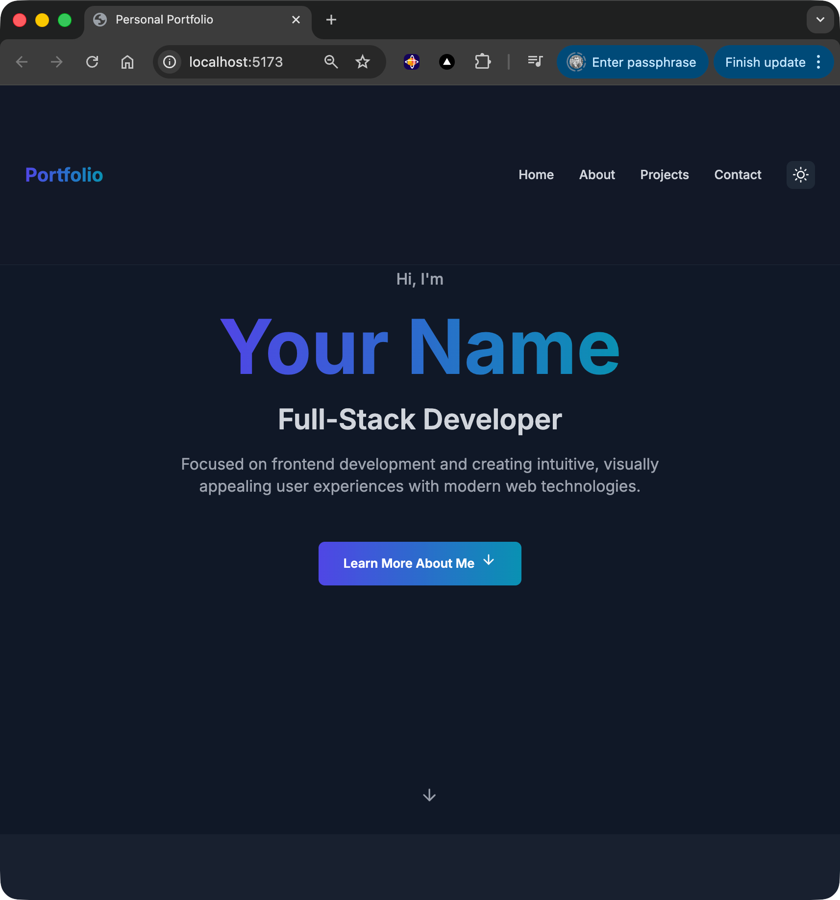
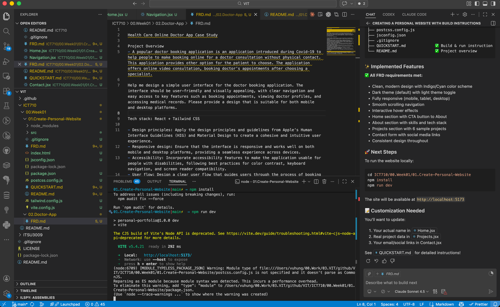

# Personal Portfolio Website

A modern, responsive personal portfolio website built with React and Tailwind CSS, featuring dark/light theme support and smooth animations.

# Screenshots

 

Live [demo](https://personal-website-navy-chi.vercel.app/): https://personal-website-navy-chi.vercel.app/

## ✨ Features

- **🎨 Modern Design**: Clean, professional design with gradient accents
- **🌓 Dark/Light Theme**: Seamless theme switching with persistent preference
- **📱 Fully Responsive**: Optimized for all device sizes
- **⚡ Fast Performance**: Built with Vite for lightning-fast development and builds
- **🎭 Smooth Animations**: Engaging hover effects and transitions
- **📧 Contact Form**: Interactive form for visitor inquiries
- **🔗 Social Integration**: Links to GitHub, LinkedIn, Twitter, and email

## 🚀 Quick Start

See [QUICKSTART.md](./QUICKSTART.md) for detailed setup instructions.

```bash
# Install dependencies
npm install

# Start development server
npm run dev

# Build for production
npm run build
```

## 📋 Sections

1. **Home** - Hero section with introduction and call-to-action
2. **About Me** - Background, skills, and technologies
3. **Projects** - Showcase of work with images and live demos
4. **Contact** - Contact form and social media links

## 🛠️ Built With

- [React](https://react.dev/) - UI library
- [Vite](https://vitejs.dev/) - Build tool
- [Tailwind CSS](https://tailwindcss.com/) - Utility-first CSS framework
- [React Icons](https://react-icons.github.io/react-icons/) - Icon library

## 🎨 Design Choices

### Color Scheme
- **Primary Colors**: Indigo (#4f46e5) - Professional and modern
- **Accent Colors**: Cyan (#0891b2) - Energetic and tech-forward
- **Neutral Tones**: Balanced grays for excellent readability

The color palette was chosen to:
- Reflect a professional yet creative brand
- Provide excellent contrast in both light and dark modes
- Create visual hierarchy and guide user attention

### Typography
- **Font Family**: Inter - Clean, modern, and highly readable
- **Font Weights**: Variable weights for visual hierarchy
- **Font Sizes**: Responsive scaling for different screen sizes

### Layout
- **Mobile-First**: Designed for mobile, enhanced for desktop
- **Grid System**: Responsive layouts using CSS Grid and Flexbox
- **Spacing**: Consistent padding and margins using Tailwind's spacing scale
- **Sections**: Clear separation with alternating background colors

### User Experience
- **Smooth Scrolling**: Gentle navigation between sections
- **Hover States**: Clear feedback on interactive elements
- **Loading States**: Future-ready for async operations
- **Accessibility**: Semantic HTML and ARIA labels

## 📁 Project Structure

```
src/
├── components/          # React components
│   ├── Navigation.jsx   # Nav bar with theme toggle
│   ├── Home.jsx        # Hero section
│   ├── About.jsx       # About Me section
│   ├── Projects.jsx    # Project showcase
│   └── Contact.jsx     # Contact form
├── App.jsx             # Main app component
├── main.jsx            # Entry point
└── index.css           # Global styles
```

## 🔧 Customization

### Update Personal Information

1. Replace placeholder text in each component
2. Update social media links in `Contact.jsx`
3. Add real project data in `Projects.jsx`
4. Replace the placeholder avatar/logo

### Modify Theme Colors

Edit `tailwind.config.js`:

```javascript
theme: {
  extend: {
    colors: {
      primary: { /* your colors */ },
      accent: { /* your colors */ }
    }
  }
}
```

## 📱 Responsive Breakpoints

- **Mobile**: < 768px
- **Tablet**: 768px - 1024px
- **Desktop**: > 1024px

## 🌐 Browser Support

- Chrome (latest)
- Firefox (latest)
- Safari (latest)
- Edge (latest)

## 📄 License

This project is open source and available for personal and educational use.

## 🤝 Contributing

Feel free to fork this project and customize it for your own portfolio!

## 📧 Contact

For questions or feedback, please use the contact form on the website or reach out via social media.

---

**Built with ❤️ using React & Tailwind CSS**
