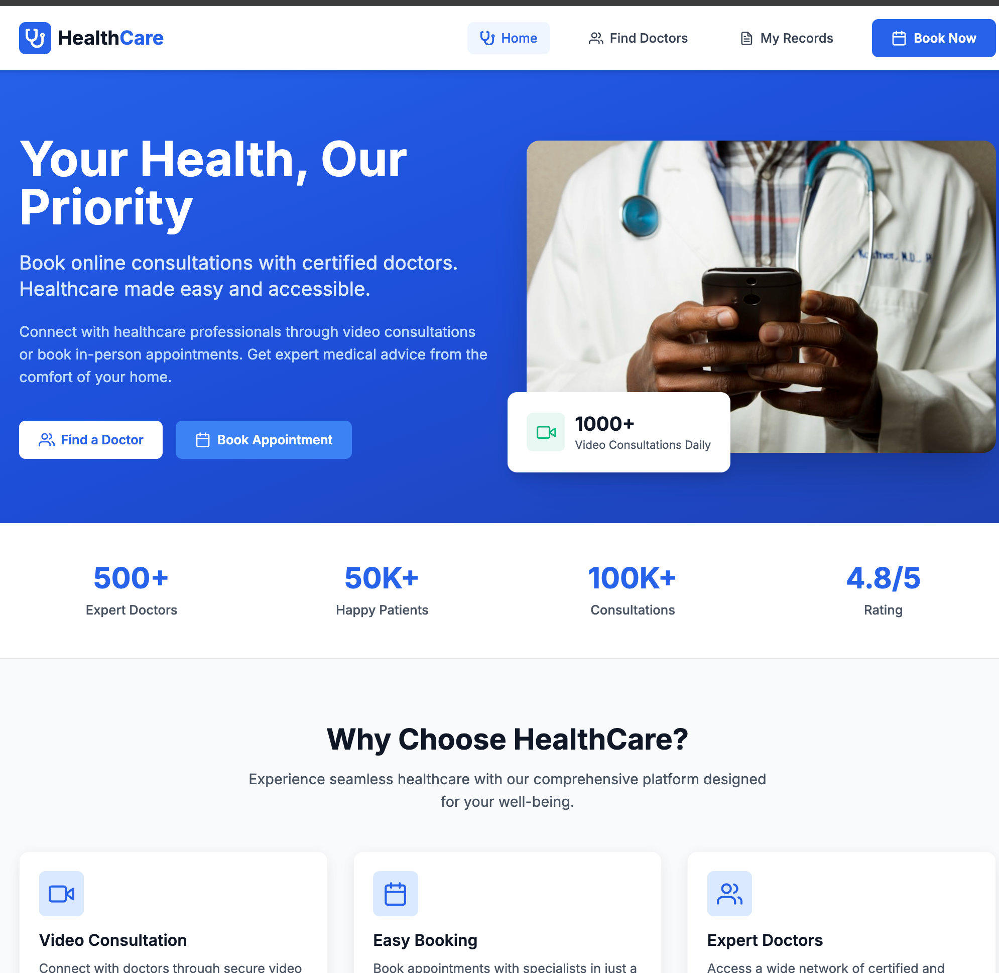
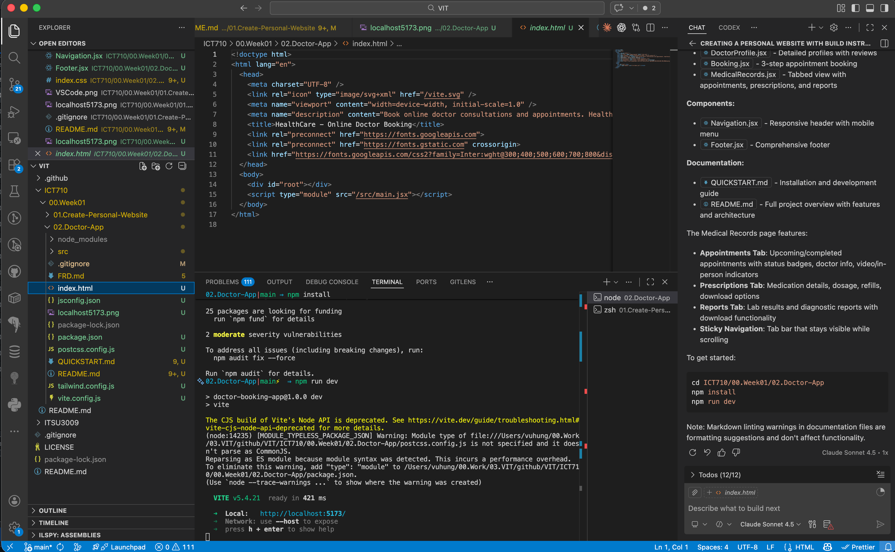

# Doctor Booking & Video Consultation Platform

A modern healthcare application that enables patients to search for doctors, book appointments, and access video consultations. Built with React and designed following Material Design and Apple HIG principles for an intuitive, accessible user experience.

## Overview

This platform provides a comprehensive solution for patients to manage their healthcare needs online. Users can discover qualified healthcare professionals across various specialties, schedule appointments (both in-person and virtual), and maintain their medical records in one convenient location.

## Screenshots

 

Live [demo](https://doctor-app-tawny.vercel.app/): https://doctor-app-tawny.vercel.app/

## Key Features

### 🔍 Doctor Discovery
- Search doctors by name or specialty
- Filter by medical specialization
- View detailed doctor profiles with qualifications, experience, and patient reviews
- Real-time availability indicators

### 📅 Smart Booking System
- Multi-step appointment booking process
- Choose between video consultations or in-person visits
- Select preferred date and time slots
- Provide symptoms and medical history
- Instant booking confirmation

### 💻 Video Consultations
- Access healthcare from anywhere
- Secure online video appointments
- Join consultations directly from your dashboard

### 📋 Medical Records Management
- View appointment history with status tracking
- Access prescriptions and medication details
- Download and manage medical reports
- Track upcoming and completed appointments

### ♿ Accessibility First
- ARIA labels and semantic HTML
- Keyboard navigation support
- Screen reader compatible
- Focus-visible states for all interactive elements
- High contrast design for readability

## Technology Stack

### Core Framework
- **React 18.2.0**: Component-based UI library with hooks
- **Vite 5.1.0**: Next-generation frontend build tool for fast development

### Styling & UI
- **Tailwind CSS 3.4.1**: Utility-first CSS framework
- **React Icons 5.0.1**: Comprehensive icon library (Feather Icons, Font Awesome)
- Custom design system with reusable components (buttons, cards, inputs)

### Routing & State
- **React Router DOM 6.22.0**: Client-side routing for multi-page navigation
- React Hooks (useState, useEffect, useNavigate, useParams, useLocation)

## Design Philosophy

### Material Design + Apple HIG
The application combines the best of both design systems:
- **Material Design**: Card-based layouts, depth through shadows, purposeful animation
- **Apple HIG**: Clean typography, generous whitespace, intuitive navigation

### Color Palette
- **Primary Blue** (#3b82f6): Trust, professionalism, healthcare
- **Medical Green** (#10b981): Health, wellness, success states
- **Soft Shadows**: Subtle depth without overwhelming the interface

### Responsive Design
- Mobile-first approach with breakpoints at 768px (tablet) and 1024px (desktop)
- Touch-friendly targets (minimum 44x44px)
- Adaptive layouts that reflow naturally across screen sizes

## Project Structure

```
02.Doctor-App/
├── src/
│   ├── components/
│   │   ├── Navigation.jsx    # Header navigation with mobile menu
│   │   └── Footer.jsx         # Site-wide footer with links
│   ├── pages/
│   │   ├── Home.jsx           # Landing page with hero and features
│   │   ├── Doctors.jsx        # Doctor listing with search/filter
│   │   ├── DoctorProfile.jsx  # Detailed doctor information
│   │   ├── Booking.jsx        # Multi-step booking process
│   │   └── MedicalRecords.jsx # Patient dashboard
│   ├── App.jsx                # Routing configuration
│   ├── main.jsx               # Application entry point
│   └── index.css              # Global styles and components
├── public/                    # Static assets
├── index.html                 # HTML template
├── package.json               # Dependencies
├── vite.config.js             # Vite configuration
├── tailwind.config.js         # Tailwind customization
└── postcss.config.js          # PostCSS configuration
```

## Getting Started

### Prerequisites
- Node.js 16 or higher
- npm or yarn

### Installation

1. Navigate to project directory:
```bash
cd ICT710/00.Week01/02.Doctor-App
```

2. Install dependencies:
```bash
npm install
```

3. Start development server:
```bash
npm run dev
```

4. Open browser to `http://localhost:5173`

### Building for Production

```bash
# Create optimized build
npm run build

# Preview production build
npm run preview
```

## User Journey

1. **Discovery**: Browse homepage to learn about services and specialties
2. **Search**: Navigate to doctors page and search by name or specialty
3. **Profile**: Click on a doctor to view detailed profile and availability
4. **Booking**: Click "Book Appointment" and complete the 3-step process:
   - Step 1: Select appointment type, date, and time
   - Step 2: Describe symptoms and reason for visit
   - Step 3: Provide patient information
   - Confirmation: Review and confirm booking
5. **Records**: Access medical records to view appointments and prescriptions

## Design Choices

### Why React + Vite?
- **Fast Development**: Vite's instant HMR makes development productive
- **Modern Standards**: ESM-first approach with optimized production builds
- **Component Reusability**: React's component model promotes code reuse

### Why Tailwind CSS?
- **Rapid Prototyping**: Utility classes speed up UI development
- **Consistency**: Centralized design tokens ensure visual coherence
- **Customization**: Easy to extend with custom colors and components

### Why React Router?
- **Client-Side Routing**: Instant navigation without page reloads
- **Dynamic Routes**: Support for doctor profiles with URL parameters
- **Browser History**: Back/forward navigation works naturally

### State Management Approach
- **Local State (useState)**: Sufficient for form inputs and UI state
- **No Global State Library**: Keeps bundle size small and complexity low
- **Future Scalability**: Can add Context API or Zustand when needed

## Accessibility Features

- Semantic HTML elements (`<nav>`, `<main>`, `<section>`, `<button>`)
- ARIA attributes (`aria-label`, `aria-expanded`, `aria-hidden`)
- Keyboard navigation (Tab, Enter, Escape)
- Focus indicators (ring-2 ring-offset-2 focus-visible)
- Screen reader announcements
- Color contrast (WCAG AA compliant)
- Touch targets (minimum 44x44px)

## Future Enhancements

- **Authentication**: User login and secure session management
- **Real-time Video**: WebRTC integration for video consultations
- **Payment Processing**: Stripe integration for appointment fees
- **Notifications**: Email and SMS appointment reminders
- **Chat Support**: Real-time messaging with doctors
- **Multi-language**: Internationalization (i18n) support

## License

This project is part of ICT710 coursework at VIT.

## Author

Created as part of Week 01 assignment for ICT710.
